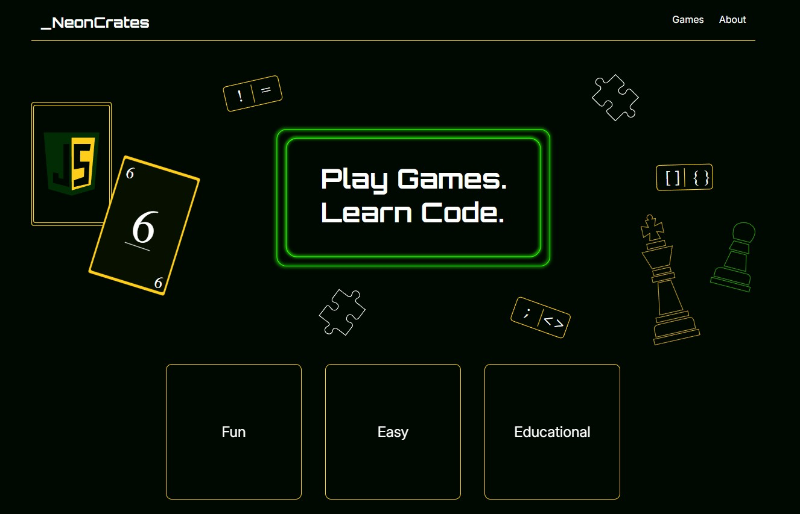
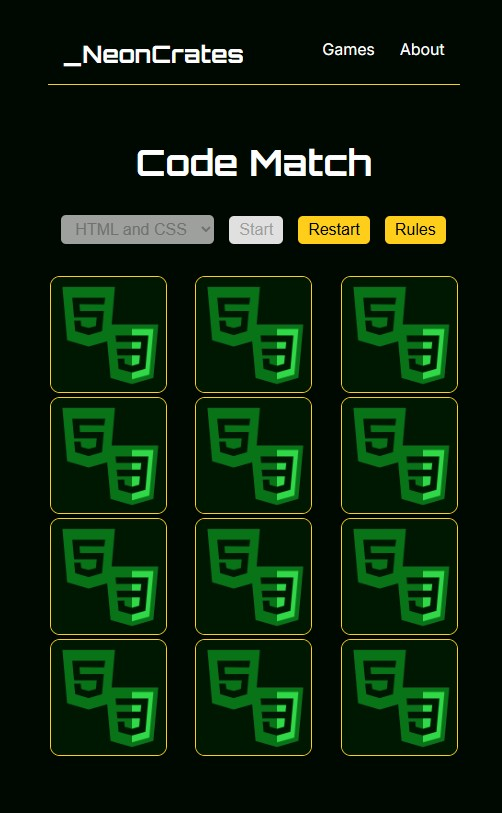

# Neon Crates

Neon Crates is a small game hub focused on simple, accessible browser games that make learning and problem‑solving feel fun.

Version One includes the game `Match Code`, a fast, accessible memory game where you pair programming terms with their matching definitions. Flip cards, find matches, and test how well you know the basics of code.





## Table of Contents
1. [Features](#features)
2. [Installation](#installation)
3. [Requirements](#requirements)
4. [Project Structure](#project-structure)
5. [License](#license)

## Features

- Accessible Controls — Full keyboard navigation for menus, cards, and in‑game actions.
- Responsive Layouts — Mobile‑friendly hero sections, optimized images, and clean scaling across screen sizes.
- Game Collection — A growing set of small browser‑based games, each with its own rules and style.
- Match Code — A memory game that pairs coding terms with their definitions.
- Keyboard Shortcuts — Quick access to start, reset, rules, and category selection.
- Rules & Instructions — Built‑in modal explaining gameplay and keyboard controls.
- Category Selection — Choose different sets of cards for Match Code.
- Focus Management — Smooth focus transitions for keyboard users, including arrow‑key movement between cards.
- Lightweight Experience — No accounts, no downloads, just quick games in the browser.

## Installation

### **Play in the Browser**
You can use the site without installing anything. Just open the live version in your browser:

--- LINK WILL GO HERE ---

No setup required.


### **Run the Project Locally**
If you want to work with the source code or modify the games, you can run the project on your machine.

1. Clone the Repository
```bash
git clone https://github.com/cunderhill17/games-for-code.git
cd games-for-code
```

2. Install Dependencies
```bash
npm install
```

3. Start the Development Server
```bash
npm run dev
```

This launches the site at the local URL shown in your terminal (usually http://localhost:5173).


## Requirements
To run the project locally, you’ll need:

1. Node.js 18+  
    - The development server and build tools rely on a modern Node environment.

2. npm 9+  
    - Used for installing dependencies and running scripts.

3. A modern browser  
    - Chrome, Firefox, Edge, or Safari — anything that supports ES modules and modern CSS.

4. Git  
    - Required only if you’re cloning the repository.

That’s all you need — no databases, no backend services, no extra configuration.


## Project Structure 
```
games-for-code/
├── public/              # Static assets served directly (icons, images, etc.)
├── src/
│   ├── assets/          # Images, icons, and other static front‑end assets
│   ├── styles/          # SCSS modules and global styles
│   ├── util/            # Small utility functions and helpers
│   ├── About.jsx        # About page component
│   ├── App.jsx          # Root component with routing
│   ├── Footer.jsx       # Site footer component
│   ├── Games.jsx        # Games page listing available games
│   ├── Header.jsx       # Site header + navigation
│   ├── Homepage.jsx     # Homepage layout and sections
│   ├── MemoryGame.jsx   # Match Code game logic and UI
│   ├── NotFound.jsx     # 404 fallback route
│   └── main.jsx         # Application entry point
├── index.html           # Base HTML template for Vite
├── package.json         # Project metadata, dependencies, and scripts
└── vite.config.js       # Vite configuration
```

## License 

This project is licensed under the MIT License — see the [LICENSE](./LICENSE) file for details.